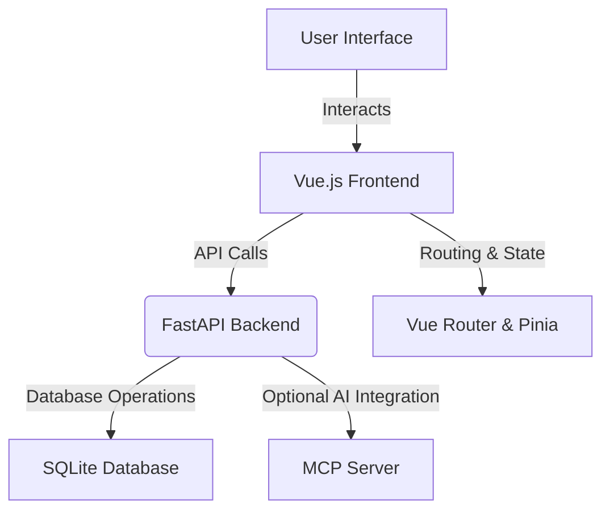

# 11Labs 2.0 - Complete Application

This repository contains the full 11Labs 2.0 application, featuring a Vue.js frontend with AI-powered coaching and a FastAPI backend. The system delivers personalized fitness coaching with real-time guidance, session tracking, and comprehensive state management.

## Table of Contents

- [Overview](#overview)
- [Architecture](#architecture)
  - [Workflow Diagram](#workflow-diagram)
  - [Frontend Architecture](#frontend-architecture)
  - [Backend Architecture](#backend-architecture)
- [Features](#features)
- [Setup & Development](#setup--development)
  - [Frontend Setup](#frontend-setup)
  - [Backend Setup](#backend-setup)
- [Deployment & Build](#deployment--build)
- [API Documentation](#api-documentation)
- [MCP Server (Optional)](#mcp-server-optional)
- [Technology Stack](#technology-stack)
- [Contribution Guidelines](#contribution-guidelines)

## Overview

11Labs 2.0 combines a modern Vue.js frontend with a robust FastAPI backend to offer a seamless, AI-powered fitness coaching experience. The application manages user sessions, delivers real-time coaching, tracks progress, and integrates optional advanced AI plan generation.

## Architecture

### Workflow Diagram



### Frontend Architecture

- **Framework:** Vue 3 using the Composition API with `<script setup>`.
- **Routing:** Vue Router 4 establishes dedicated routes for:
  - Welcome, Login, Workout Plan Generation, Sport/Agent Selection, Session Setup, Live Coaching, Dashboard, Settings, Workout Overview, and Workout Session/Celebration screens.
- **State Management:** Utilizes Pinia to manage user sessions, profiles, and workout histories.
- **Styling:** Tailwind CSS ensures a responsive, modern UI.
- **Tooling:** Vite provides fast bundling and development.

### Backend Architecture

- **Framework:** FastAPI serves the API endpoints.
- **Database:** SQLite is used via SQLAlchemy/SQLModel with asynchronous support.
- **API Endpoints:**
  - **Session Reporting:** `POST /users/{user_id}/plans/{plan_id}/session`
  - **Progress Tracking:** `GET /users/{user_id}/progress`
- **Development:** Runs with Uvicorn for hot reloading and efficient testing.
- **Optional Integration:** An MCP server allows advanced AI workout plan generation with direct database access.

## Features

- **AI Coaching:** 
  - ElevenLabs voice coaching with multiple coach personalities.
  - Real-time exercise guidance and pose detection.
- **Dynamic Workout Flow:** 
  - Detailed workout overviews, progressive exercise sessions, and celebratory completion screens.
- **Progress Tracking:** 
  - Monitors session completion, weekly stats, and historical performance.
- **Responsive Design:** 
  - Smooth navigation and persistent state management across routes.
  
## Setup & Development

### Frontend Setup

1. Navigate to the frontend directory:
   ```bash
   cd frontend
   ```
2. Install dependencies and start the development server:
   ```bash
   npm install
   npm run dev
   ```
   - Access the app at [http://localhost:5173](http://localhost:5173).

### Backend Setup

1. Navigate to the Backend directory:
   ```bash
   cd Backend
   ```
2. Set up a virtual environment and install dependencies:
   ```bash
   python -m venv .venv && .venv\Scripts\activate  # Windows
   pip install -r requirements_mcp.txt
   ```
3. Start the FastAPI server:
   ```bash
   uvicorn main:app --reload --host 0.0.0.0 --port 8000
   ```
   - View API docs at [http://localhost:8000/docs](http://localhost:8000/docs).

## Deployment & Build

### Frontend Build

1. Build the application for production:
   ```bash
   cd frontend
   npm run build
   ```
2. Preview the production build:
   ```bash
   npm run preview
   ```

### Backend Deployment

- Configure the environment variables (e.g., `DATABASE_URL`, `OLLAMA_URL`) as needed before deploying the backend.

## API Documentation

- **Session Completion:** `POST /users/{user_id}/plans/{plan_id}/session`
- **User Progress:** `GET /users/{user_id}/progress`
- Additional endpoints are fully documented in the Swagger UI at [http://localhost:8000/docs](http://localhost:8000/docs).

## MCP Server (Optional)

For extended AI integration, run the MCP server:

- **Basic MCP Server:**
  ```bash
  cd Backend
  python mcp_server.py
  ```
- **Enhanced MCP Server with AI plan generation:**
  ```bash
  cd Backend
  python mcp_server_enhanced.py
  ```

## Technology Stack

- **Frontend:** Vue 3, Vue Router 4, Pinia, Tailwind CSS, Vite
- **Backend:** FastAPI, SQLite, SQLAlchemy/SQLModel, Uvicorn
- **Optional:** MCP server for advanced AI integration

## Contribution Guidelines

Contributions are welcome! Please adhere to the following guidelines:

1. Fork the repository and create your branch from `main`.
2. Write clear commit messages and document your changes.
3. Submit a pull request with detailed descriptions.
4. Ensure all tests pass before merging.

---

Happy coding! For any issues or questions, please use
